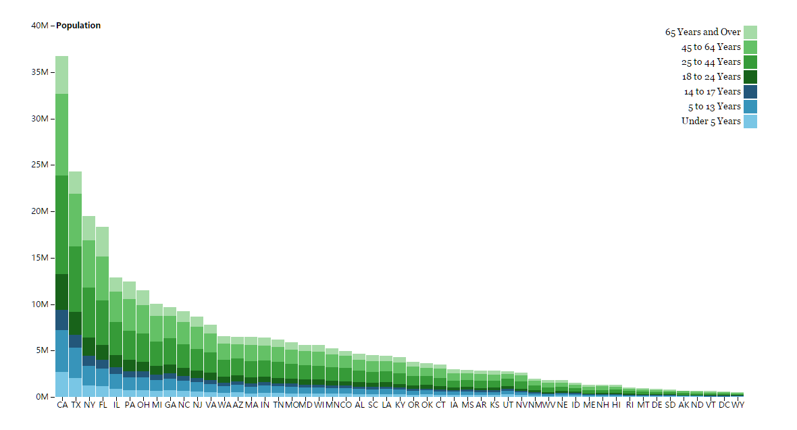

This Repo is my visualization work. It includes variety of domains: maps, data structures, high dimensional data, etc..

-------------------

Warmup Visualization
===========
>Before I can handle an indivual project, I did some practice about how to present the data and realize the iteractive functions like **zoom**, **drag-move**, **click**, **moveover** and **moveout**. The following link is the example visualizations with interactions:
[Example Visualizations](https://wangku.github.io/Visualizations/Practice/practice.html)

>I also did some other regular graph like **stack bar graph**. It depends on the **[data_population.csv](https://github.com/Wangku/Visualizations/tree/gh-pages/Practice/data_population.csv)** file. The data has the following example structure:

>State|Under 5 Years|5 to 13 Years|14 to 17 Years|18 to 24 Years|25 to 44 Years|45 to 64 Years|65 Years and Over
>-------|------|-------|------|------|------|-------|------
>AL|310504|552339|259034|450818|1231572|1215966|641667
>AK|52083|85640|42153|74257|198724|183159|50277
>AZ|515910|828669|362642|601943|1804762|1523681|862573
>AR|202070|343207|157204|264160|754420|727124|407205

>It has 8 columns, first column shows the name of state, and the other seven columns show the population in different age range. First visualization I did is pretty normal stack bar graph. Different color represents different age range.

>You can also click the website link **[StackedBarChart](https://wangku.github.io/Visualizations/Practice/Stacked_Bar_Chart.html)** to see the detail.

>Then I did two variants. Same data source and same color representation, while using radial present method. You can check the following two website links finding the detail.
>
>**[Radial_Stacked_Bar_1st](https://wangku.github.io/Visualizations/Practice/Radial_Stacked_Bar_1st.html)**
>
>**[Radial_Stacked_Bar_2nd](https://wangku.github.io/Visualizations/Practice/Radial_Stacked_Bar_2nd.html)**

--------------------

Hierarchy Structure
=========
>**Hierarchy** is defined as __Data repository in which cases are related to subcases__. It can be thought of as imposing an ordering in which cases are parents or ancestors of other cases. The family histories, file/direcotry systems on computers and Object-oriented software classes are all hierarchy structure. 

>I design and implement some visualizations to present the hierarchy structure. The data I used has the following structure as example:

> id | value
>------------|------------
>flare |
>flare.analytics|
>flare.analytics.cluster|
>flare.analytics.cluster.AgglomerativeCluster|3938
>flare.analytics.cluster.CommunityStructure	|3812
>flare.animate	|
>flare.animate.Easing	|17010
>flare.animate.FunctionSequence	|5842

>The table is part of **[flare.csv](./flare.csv)** file. It has two columns, one is **id**, and the other is **value**. The **id** string is combined by one or several substrings with the symbol **'.'**. In the example table, the id **flare.analytics.cluster.AgglomerativeCluster** has one more substring than the id **flare.analytics.cluster**, that means **flare.analytics.cluster** is the parent of **flare.analytics.cluster.AgglomerativeCluster**, so it can be treated as a hierarchy structure. There are some visualizations for presenting this data:
>- Circle Packing [CirclePackingDemo](https://wangku.github.io/Visualizations/TreeStructure/CirclePacking.html)
>
>- Packing     [PackingDemo](https://wangku.github.io/Visualizations/TreeStructure/Packing.html)
>
>- Tree [TreeDemo](https://wangku.github.io/Visualizations/TreeStructure/Tree.html)
>
>- RadialTreeGraph [RadialTreeDemo](https://wangku.github.io/Visualizations/TreeStructure/RadialTreeGraph.html)
>
>- TreeMap [TreeMapDemo1](https://wangku.github.io/Visualizations/TreeStructure/TreeMap.html) [TreeMapDemo2](https://wangku.github.io/Visualizations/TreeStructure/TreeMap_2nd.html)
>
>- Sunburst [SunburstDemo](https://wangku.github.io/Visualizations/TreeStructure/Sunburst.html)
>

First Project
=========
>This is my first complex project which is based on Dr.Yao's Nature paper *[Health ROI as a measure of misalignment of biomedical needs and resources](http://www.nature.com/nbt/journal/v33/n8/full/nbt.3276.html)*.

>

>The visualization will be showed at the following website link:
[Nature Paper Visualization](https://wangku.github.io/Visualizations/1st%20project/NaturePaperVisualization.html)

Maps Visualization
=========

