- **Nature Paper Visualization**

<a href="https://wangku.github.io/Visualizations/NaturePaperVisualization/NaturePaperVisualization.html">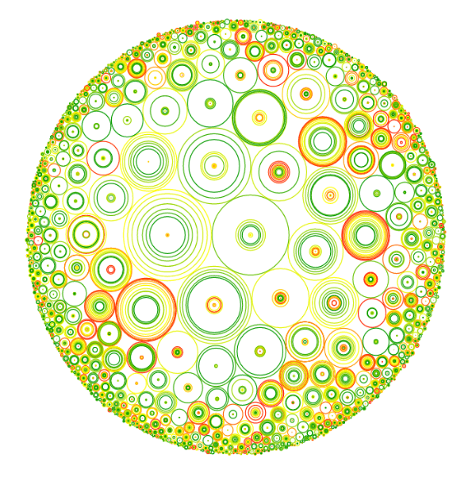</a>
-------------

- **Tree Structure Visualization-Circle Packing**

<a href="https://wangku.github.io/Visualizations/TreeStructureVisualization/CirclePacking.html">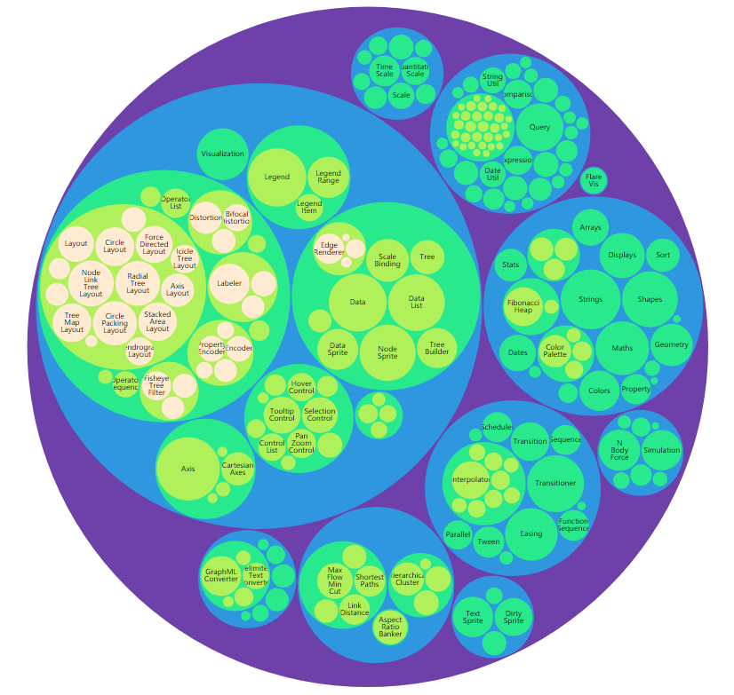</a>

---------

- **Tree Structure Visualization-Packing**

<a href="https://wangku.github.io/Visualizations/TreeStructureVisualization/Packing.html">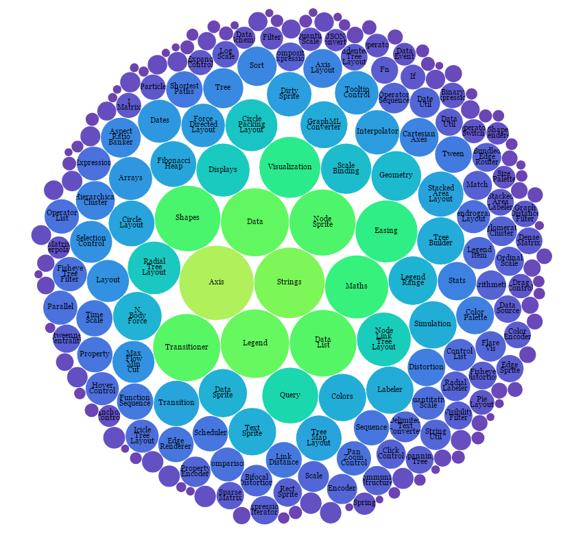</a>
------------------

- **Tree Structure Visualization-Tree**

<a href="https://wangku.github.io/Visualizations/TreeStructureVisualization/Tree.html">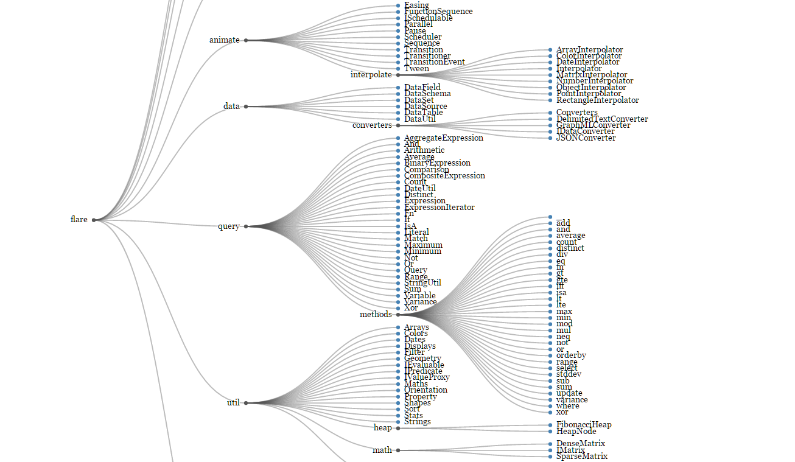</a>
-------------------

- **Tree Structure Visualization-Radial Tree**

<a href="https://wangku.github.io/Visualizations/TreeStructureVisualization/RadialTree.html">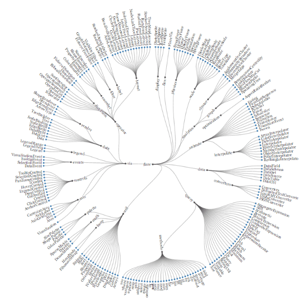</a>
---------------------

- **Tree Structure Visualization-TreeMap**

<a href="https://wangku.github.io/Visualizations/TreeStructureVisualization/TreeMap.html">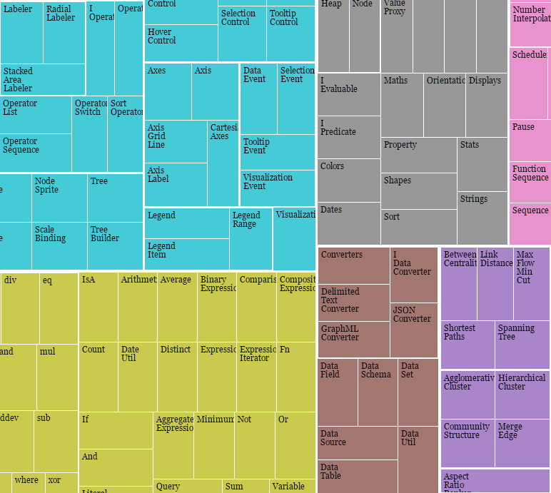</a>
----------------

- **Tree Structure Visualization-TreeMap**

<a href="https://wangku.github.io/Visualizations/TreeStructureVisualization/TreeMap2.html">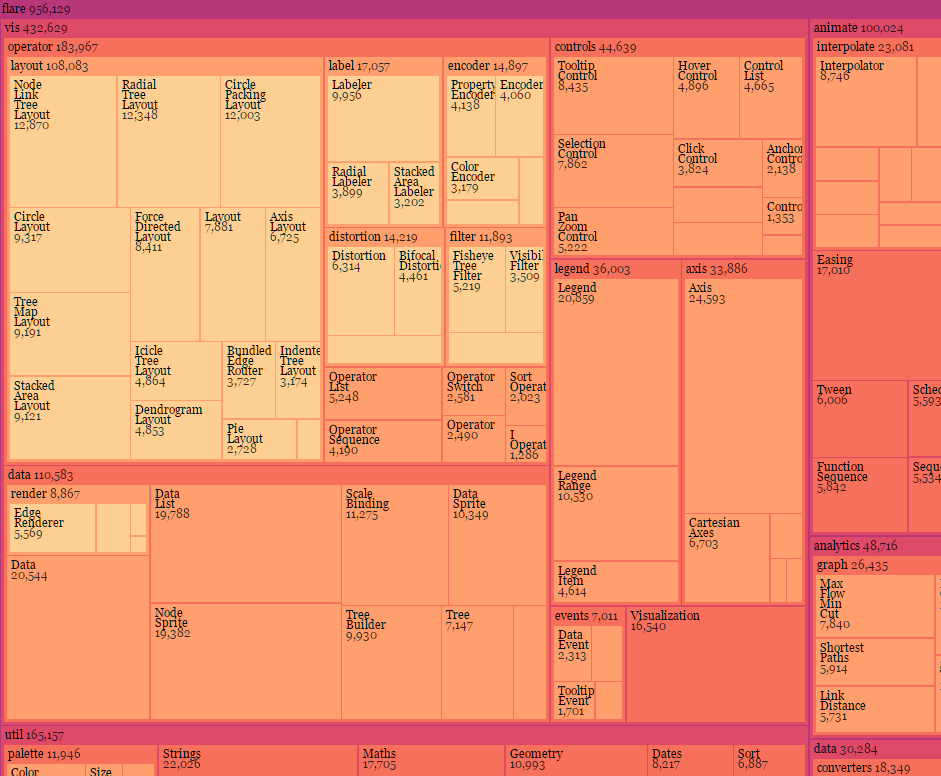</a>
-----------------

- **Tree Structure Visualization-Sunburst**

<a href="https://wangku.github.io/Visualizations/TreeStructureVisualization/Sunburst.html">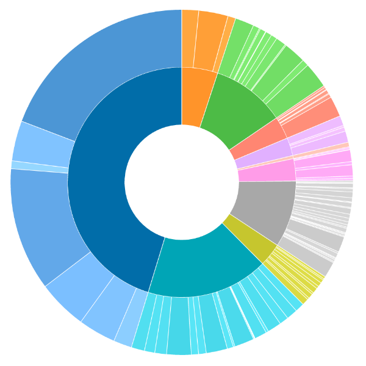</a>
----------------------

- **Streaming Shapefile**

<a href="https://wangku.github.io/Visualizations/GeographicalInformationVisualization/Streaming shapefile.html">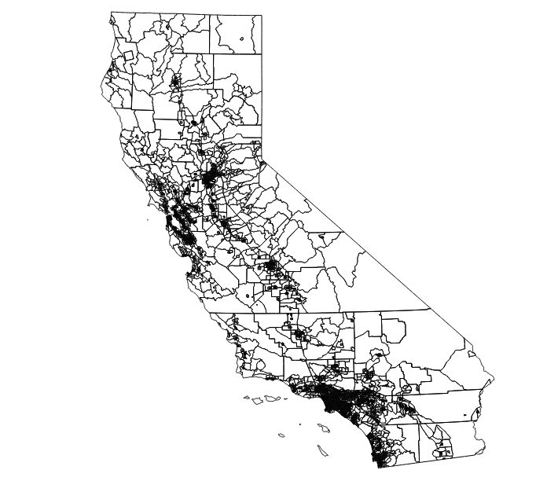</a>
------------------------

- **Coastal Graph Distance**

<a href="https://wangku.github.io/Visualizations/GeographicalInformationVisualization/CoastalGraphDistance.html">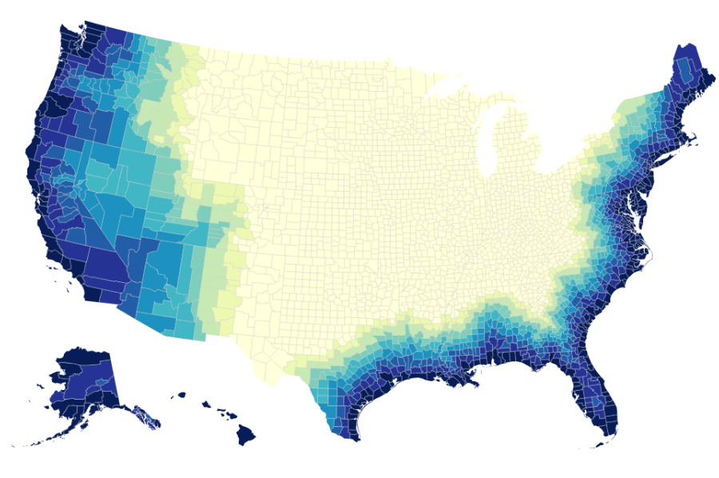</a>
---------------

- **Population**

<a href="https://wangku.github.io/Visualizations/GeographicalInformationVisualization/Maps_population.html">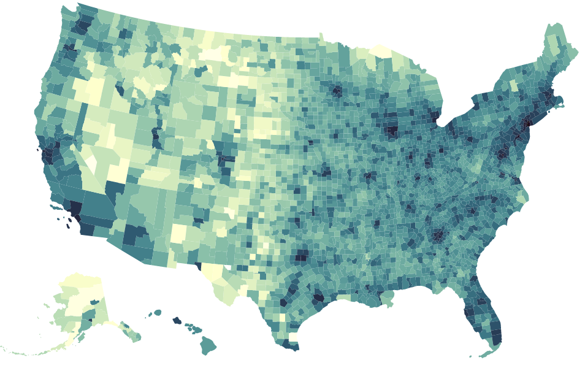</a>
-----------------

- **Metropolitan Statistical Area**

<a href="https://wangku.github.io/Visualizations/GeographicalInformationVisualization/MSA.html">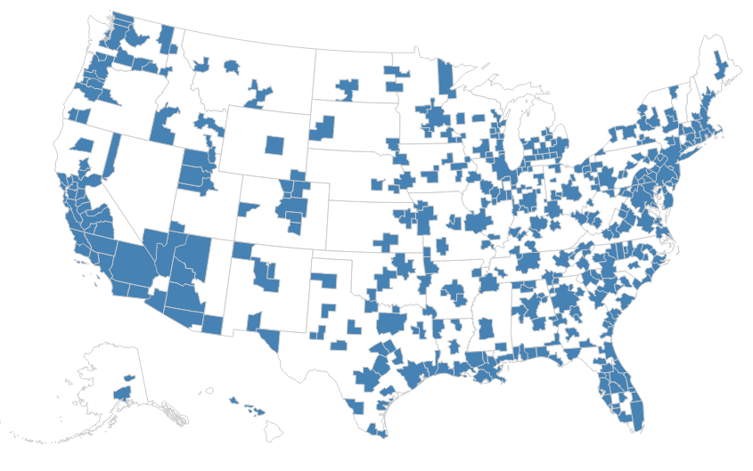</a>
----------------------

- **Radial Stacked Bar**

<a href="https://wangku.github.io/Visualizations/RadialStackedBar/RadialStackedBar.html">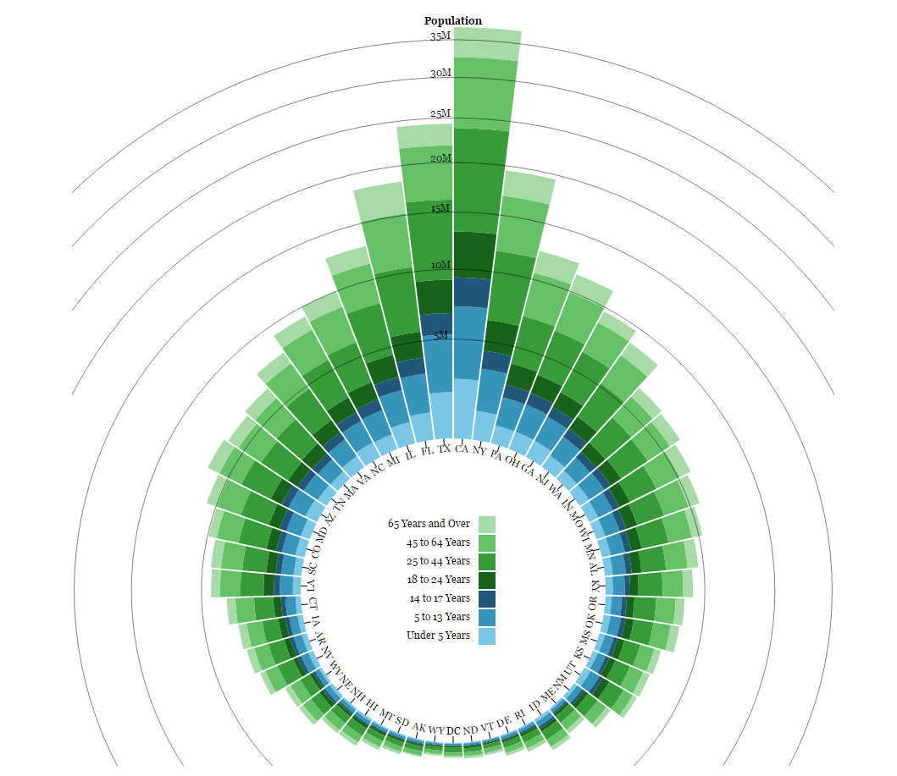</a>
------------------